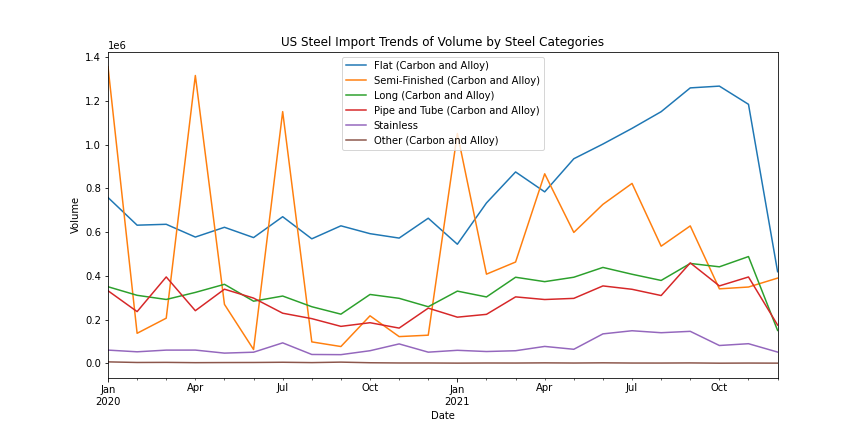
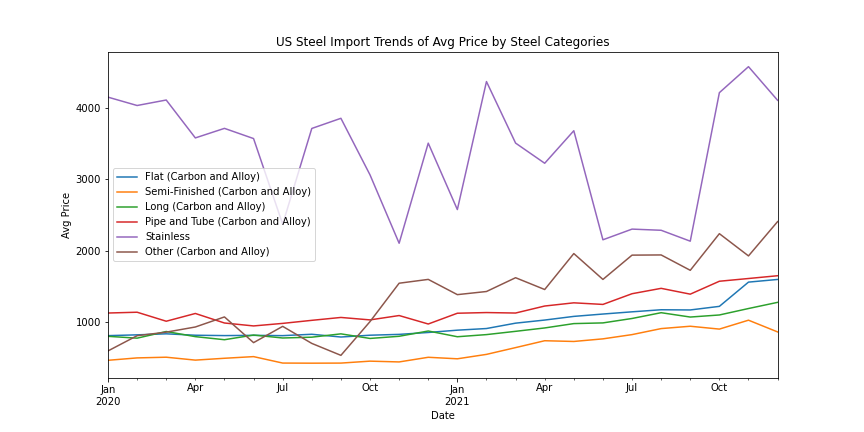
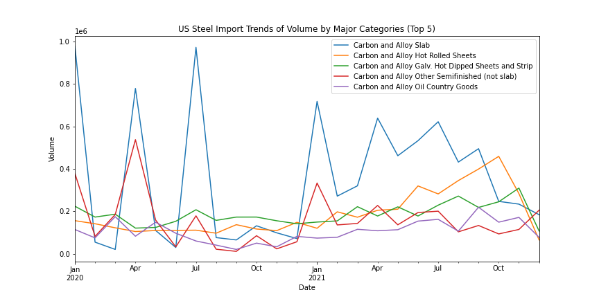
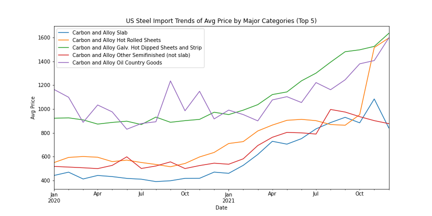
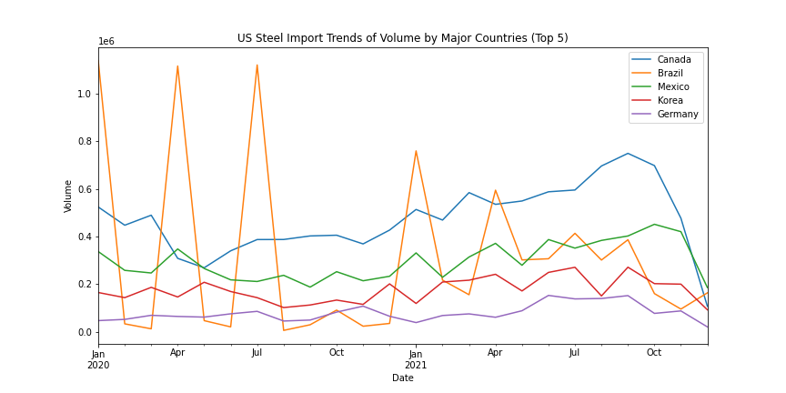
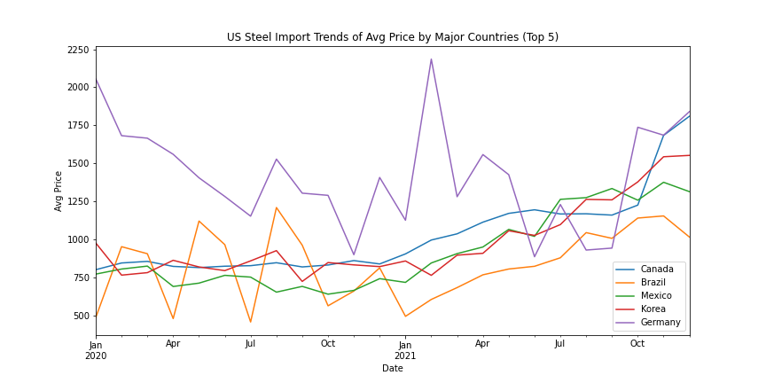
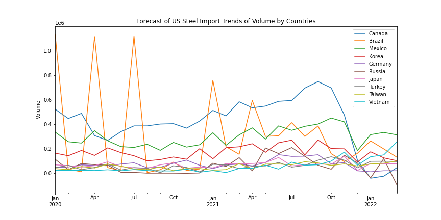

# Case-Study-of-U.S.-Steel-Import

**Authors**: Ning Chen

## Overview

In the United States, the price of steel has increased significantly since Feb '21. The general question is whether this price increase will be permanent or if the price will return to previous levels at some point in the future. One potential way the price may come back down is if there is a flood of Mexican or Turkish steel (because those geographies don't have high tariffs). Can you try to aggregate all steel coming into the US by which country they are coming from? Are there any differences in the trends in the major categories of steel being imported What implications do you think the current importation trends will have on steel prices? Can you make a forecast about what you think 2021 year-end steel imports will be by country?
Can you figure out a way to get a sense of steel inventories of current US mills? Note: for this question, just brainstorm any ways you might answer this, but don't actually do anything.

### Category

### Product Category

### Country

